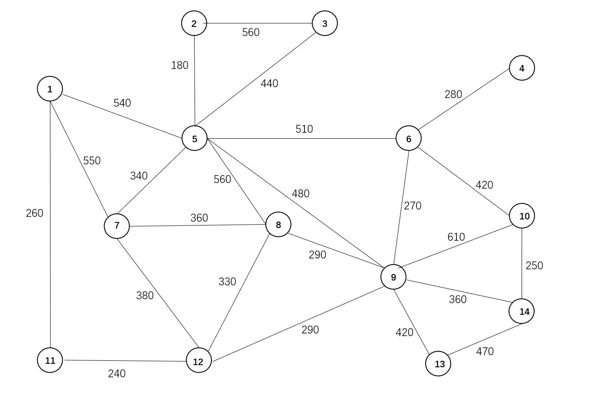

# TSP

## 问题
车辆巡逻是机场进行围界动态巡视和突发事件快速响应的重要方式。以往，当部分站坪监控系统摄像机无法覆盖的区域发生突发事件时，现场巡逻人员由于缺乏将巡逻画面实时传输至监控中心的有效手段，无法实现临时布控，不利于监控中心准确获取现场情况，进行快速指挥处置。

“5G+4K”巡逻车辆视频实时回传系统通过5G车载视频设备，可将高清实时画面同步传输至监控中心，为应急指挥提供更为便捷、快速、灵活的临时布控方案，有效强化机场空防安全保障。同时，可实现历史监控数据的快速回放，解决传统车载监控数据仅支持本地存储，无法联网传输的问题。

在巡逻过程中，巡逻车辆完成所有地点的巡逻任务，返回到出发地点，此时称为完成一次整体巡逻任务。完成一次整体巡逻任务所需要的时间是主要考虑的因素，按照巡逻车辆从出发开始至返回到出发地点的时间来计算。在巡逻过程中，不考虑巡逻车辆在各个点的停留时间。

为了尽快完成车辆巡逻任务，请根据附件所给数据解决以下几个问题：

1、图1 给出14个地点，若目前巡逻车辆在第9个地点，请结合附件，建立完成一次整体巡逻任务的数学模型，并给出最优方案。 

2、若提供两辆巡逻车辆，计划在图1中设置两个巡逻车辆出发地点，建立完成一次整体巡逻任务的数学模型，确定两个出发地点的最佳位置。

注：巡逻车辆的平均巡逻速度为 20km/h。

## 题目解析

将地点抽象成图，通过 Floyd 算法即可求出所有点之间的最短距离。

第一问就是经典TSP问题，就是求一个经过所有点的环，并使其长度最小。

第二问就是求两个环，使两个环包含所有的点，并使其最大值最小。

## 代码

因为使用了类型注解，部分 Python 版本运行时可能会报错。如果不能运行，考虑删除类型注解或升级你的 Python 版本。

[graph.py](graph.py) 初始化图，返回一个包含各点最短路径的 Graph 实例。

- [模拟退火 第一问](sa_1.py)
- [模拟退火 第二问](sa_2.py)
- [禁忌搜索 第一问](ts_1.py)
- [禁忌搜索 第二问](ts_2.py)

禁忌搜索，第二问用迭代优化了一下，所以相较于第一问代码差距较大。
